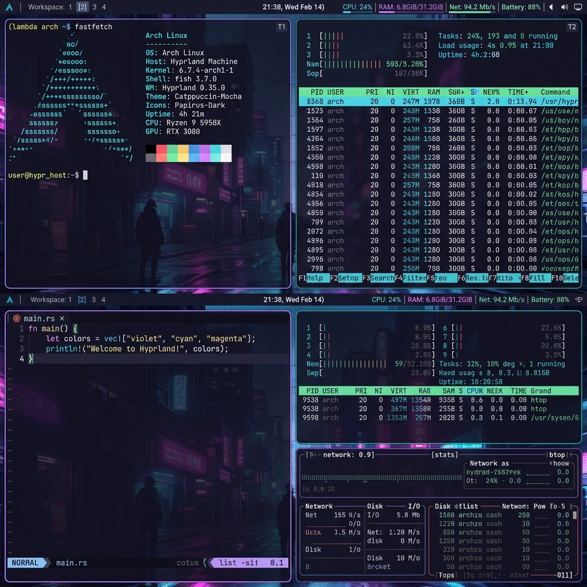
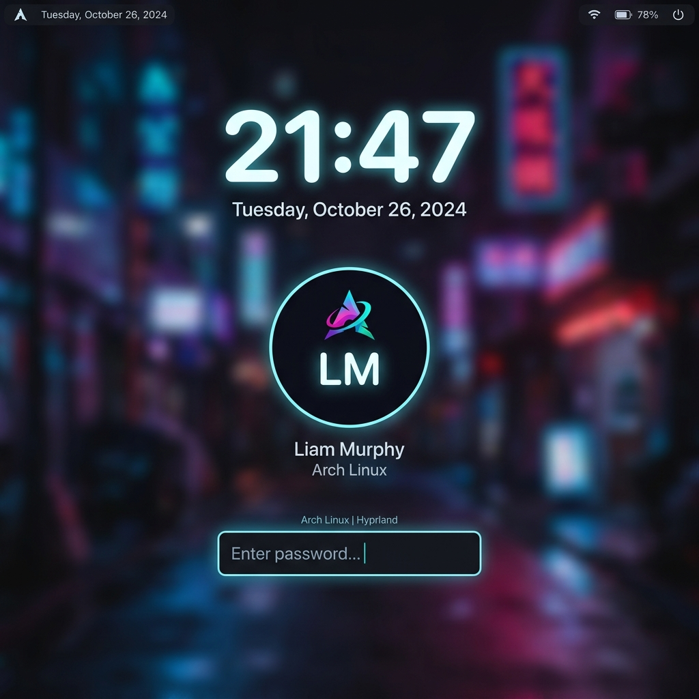
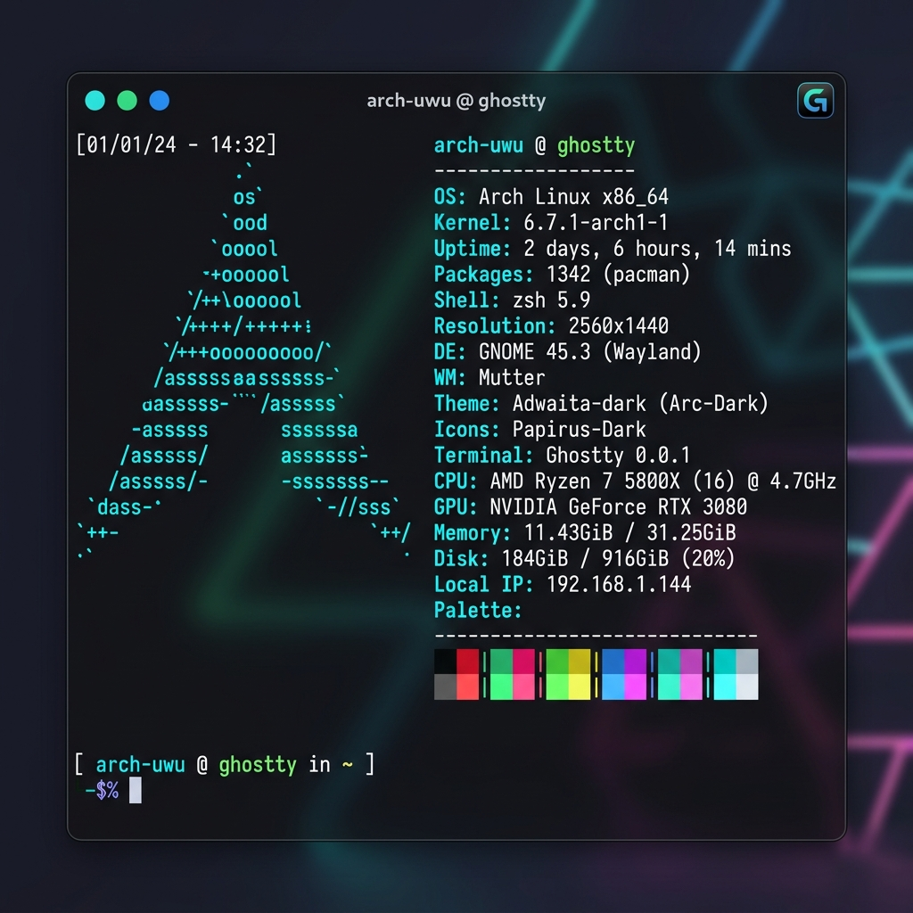
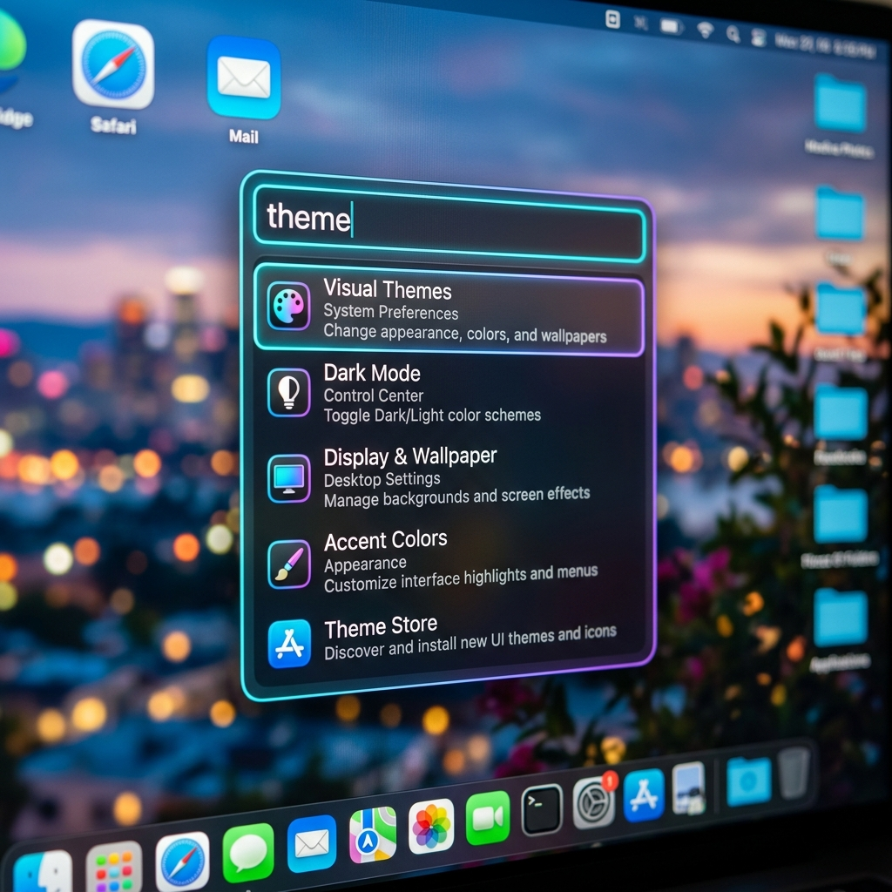
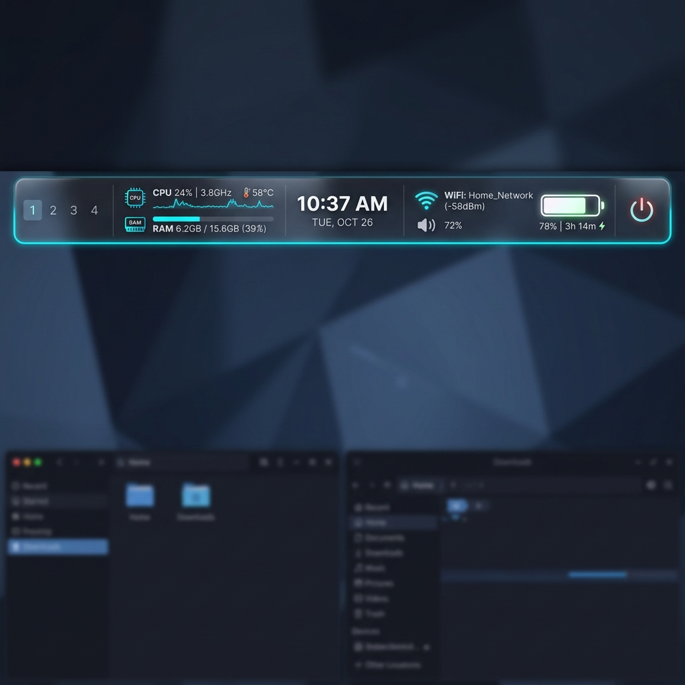

# lumina-dots

<p align="center">
  
  
</p>
<p align="center">
  
  
  
</p>

**Production-grade Hyprland dotfiles for Arch Linux**
**Lenovo LOQ 15IRX9 · i7-14700HX · RTX 4060 · 144Hz**

---

## Stack

| Layer | Component |
|---|---|
| **Compositor** | Hyprland |
| **Session** | UWSM |
| **Lock** | Hyprlock (boot-lock on TTY1 autologin) |
| **Shell Feedback** | Lumina Shell OSD, modes, popups + HyprPanel fallback |
| **Launcher** | Walker |
| **Idle** | Hypridle (UPower battery-gated suspend) |
| **Wallpaper** | `swww` (Arch `extra/awww` provider via compatibility wrappers) + Waypaper |
| **Color Engine** | Matugen (Material You adaptive colors) |
| **GTK Theme** | adw-gtk3-dark |
| **Icons** | Papirus-Dark |
| **Cursor** | Bibata-Modern-Ice |
| **Terminal** | Ghostty |
| **Shell** | Zsh + Starship |
| **Editor** | LazyVim (Neovim) |
| **File Manager** | Nautilus (GUI) + Yazi (TUI, cwd sync) |
| **Notifications** | Lumina popup path with HyprPanel fallback |
| **Screenshots** | Grimblast + Satty |
| **Clipboard** | Cliphist + Wl-Clipboard |
| **Power Menu** | Wlogout |
| **Audio** | Pipewire + Wireplumber + EasyEffects |
| **Bluetooth** | Bluez + Blueman |
| **Brightness** | Brightnessctl + Hyprsunset |
| **Power** | AutoCPUFreq + UPower |
| **Media** | Playerctl + mpv |
| **Window Switch** | Hyprswitch (Alt+Tab) |
| **AUR** | Paru |
| **Filesystem** | Btrfs + Snapper + Snap-pac |
| **GPU Policy** | Intel integrated by default; NVIDIA optional/offload-only |

---

## Quick Start

```bash
REPO_URL="https://github.com/RandomGuy1006/lumina-dots"
git clone "$REPO_URL" "$HOME/lumina-dots"
cd "$HOME/lumina-dots"
bash install.sh install --host=loq-15irx9
bash install.sh doctor
```

On first run, the installer auto-detects the host (`loq-15irx9` or `generic`) and runs all phases. Host aliases `loq`, `loq15irx9`, and `loq-15irx9` all resolve to the LOQ profile. For non-LOQ hardware, omit the `--host` flag or use `--host=generic` — safe defaults apply without any hardware-specific tuning. If a phase requires a reboot, the installer halts cleanly with resume instructions.

Older guide commands are still supported:

```bash
./setup all --host=loq-15irx9
./setup doctor
wallpaper-change ~/Pictures/Wallpapers/image.jpg
```

---

## Install Phases

```
Step 1 — System       Locale, timezone, pacman, paru, zram, Snapper
Step 2 — Packages     ~70 packages (pacman + AUR), keyring-safe upgrade
Step 3 — Dotfiles     link::create_tree symlinks, seed colors.conf, install CLI
Step 4 — Theme        GTK, fontconfig, cursor, initial Matugen run
Step 5 — Hardware     NVIDIA KMS, mkinitcpio, Btrfs swap, envycontrol (reboot gate)
Step 6 — Services     Pipewire, portals, TTY autologin, snap-pac
```

On Btrfs systems, package-changing phases now use strict Snapper gates: if a safety snapshot cannot be created, the phase aborts before bulk package work. GRUB installs also get `grub-btrfs` integration for snapshot boot entries.

Package baselines (current verified manifests):

- **pacman**: 112 unique packages
- **AUR**: 11 default entries

---

## The `dotfiles` CLI

After install, the `dotfiles` command is available system-wide:

```bash
dotfiles update              # Pull latest + rebuild packages + re-symlink
dotfiles doctor              # system health checks
dotfiles doctor --full       # deeper runtime health checks
dotfiles validate services   # targeted runtime validation
dotfiles theme <wallpaper>   # Apply Matugen theme from any image
dotfiles rollback            # Guided Btrfs snapshot restore
dotfiles shell status        # Lumina Shell status, modes, and popup events
dotfiles welcome             # First-login Welcome app
dotfiles keybinds            # Searchable keybind overlay
dotfiles control             # Lumina Control Center
dotfiles doctor-dashboard    # Graphical health dashboard
dotfiles snapshot list       # List Btrfs snapshots
dotfiles activity --json     # Inspect Lumina activity history
dotfiles theme-studio        # Theme Studio product app
dotfiles hub --json          # Lumina Hub state and launch surface
dotfiles mission-control     # Workspace and window overview
dotfiles ai "explain doctor" # Optional local-first assistant
dotfiles pomodoro status    # Pomodoro timer status
dotfiles cleanup --json     # Cleanup Manager status
dotfiles workspace-template dev # Launch a saved workspace layout
lumina-firewall dev-lan      # LAN-only development firewall profile
lumina-tunnel socks host 1080 # localhost-bound SSH SOCKS tunnel
dotfiles test                # Run regression + link + service test suite
dotfiles help
```

The root installer exposes the same command surface:

```bash
bash install.sh install       # full install
bash install.sh dotfiles-only # relink configs and seed generated files
bash install.sh packages-only # package phase only
bash install.sh hardware-only # LOQ kernel, sleep, GPU, and power tuning
bash install.sh update        # snapshot, pull, package sync, relink, doctor
bash install.sh backup "before-hyprland-update"
bash install.sh theme ~/Pictures/Wallpapers/image.jpg
bash install.sh rollback list
```

Routine updates intentionally ignore fast-moving desktop packages that can break the shell surface between releases: `ags-hyprpanel-git`, `hyprswitch`, `walker-bin`, and `matugen-bin`. Update them one at a time after a manual snapshot.

---

## Color Pipeline

One command recolors everything in real time:

```
dotfiles theme ~/Pictures/Wallpapers/image.jpg
       │
       ├─ swww img (smooth transition)
       ├─ matugen image -c ~/.config/matugen/config.toml → generates:
       │       ├─ ~/.config/hypr/colors.conf        (borders, accents)
       │       ├─ ~/.config/hypr/hyprlock-colors.conf (lockscreen)
       │       ├─ ~/.config/ghostty/themes/LoqDynamic (terminal)
       │       ├─ ~/.config/btop/themes/loq.theme   (system monitor)
       │       ├─ ~/.config/walker/themes/generated.css (launcher)
       │       ├─ ~/.config/hyprpanel/theme.generated.json (bar)
       │       ├─ ~/.config/starship.toml           (prompt)
       │       ├─ ~/.config/yazi/theme.toml         (file manager)
       │       └─ ~/.config/wlogout/colors.css      (power menu)
       └─ sync-surfaces.sh     (token render + Hyprland reload + Hyprpanel rebuild/restart)
```

### Unified design tokens (visual-tokens.json)

Matugen renders a centralized token file first:

- `~/.cache/lumina/visual-tokens.json` (generated from `matugen/.config/matugen/templates/visual-tokens.json`)

Then `scripts/theme/render-visual-tokens.sh` renders those tokens into runtime surfaces:

- Hyprland: `~/.config/hypr/tokens.conf`
- Walker: `~/.config/walker/themes/generated.css`
- Wlogout: `~/.config/wlogout/colors.css`
- Ghostty: `~/.config/ghostty/lumina-tokens.conf`
- Hyprpanel: `~/.config/hyprpanel/theme.generated.json`

The renderer is **fail-fast**: it aborts if required token keys are missing, preventing malformed outputs like `nullpx`.

---

## Architecture

```
lumina-dots/
├── hypr/            → ~/.config/hypr/        (Hyprland, Hyprlock, Hypridle)
├── shell/           → ~/.zprofile, ~/.zshrc, ~/.config/zsh/
├── uwsm/            → ~/.config/uwsm/         (Wayland session env)
├── ghostty/         → ~/.config/ghostty/
├── matugen/         → ~/.config/matugen/      (12 adaptive templates)
├── hyprpanel/       → ~/.config/hyprpanel/
├── walker/          → ~/.config/walker/
├── gtk/             → ~/.config/gtk-{3,4}.0/
├── btop/            → ~/.config/btop/
├── nvim/            → ~/.config/nvim/         (LazyVim)
├── waypaper/        → ~/.config/waypaper/
├── wlogout/         → ~/.config/wlogout/
├── systemd/         → ~/.config/systemd/user/ (session target + services)
├── lib/             → Bash libraries (log, link, host, pkg, aur, check)
├── hosts/           → LOQ host profile plus legacy compatibility aliases
├── scripts/install/ → Install phases 01–06
├── scripts/theme/   → apply-theme.sh, switch-wallpaper.sh, start-swww-daemon.sh
├── scripts/system/  → polkit.sh, battery-alert.sh
├── tests/           → validate-repo.sh, test-regressions.sh
└── docs/            → install-manual.md, install-archinstall.md, keybindings.md
```

**Symlink engine**: `lib/link.sh` — `link::create_tree` (replaces GNU Stow). Idempotent, backs up existing files, verifiable.

---

## Recovery

| Problem | Fix |
|---|---|
| Desktop broken | `Super + Shift + R` — reload + restart Hyprpanel |
| Hyprpanel dead | `Ctrl + Alt + F2` → `hpanel` alias → re-login |
| No compositor | `HYPRLAND_NO_AUTOSTART=1 Hyprland` (loads fallback config) |
| Colors broken | `dotfiles theme $(cat ~/Pictures/Wallpapers/.current)` |
| Screen black on boot | Verify `i915.enable_psr=0` in `/boot/refind_linux.conf` |
| Stuck at 60fps | `hyprctl monitors` → check monitor= line in `custom/monitors.conf` |
| Hibernate broken | Verify `resume=UUID=...` + `resume_offset=...` in kernel params |
| Roll back | `dotfiles rollback` (interactive Btrfs snapshot restore) |

---

## Key Design Decisions

- **No `snapper rollback`**: uses btrfs subvolume snapshot + mv for safe offline rollback
- **No hardcoded paths**: all scripts use `$DOTFILES_DIR` derived from `BASH_SOURCE[0]`
- **colors.conf is never symlinked**: seeded by installer, overwritten by Matugen — not tracked
- **hyprlock-colors.conf** same treatment — seeded at install, owned by Matugen thereafter
- **NVIDIA env vars** are conditional in host profile — safe for both hybrid and integrated mode
- **Exit code 20** reboot gate: hardware step returns 20 on GPU mode change, installer halts cleanly
- **Single wallpaper vocabulary**: configs call `swww`/`swww-daemon`. On Arch, `extra/awww` replaces/provides the legacy stack; `scripts/system/install-swww-compat.sh` installs compatibility wrappers so `swww` continues to work.

---

## Documentation Map

| Guide | Purpose |
|---|---|
| `docs/install-archinstall.md` | Fast install path using Archinstall, with dual-boot notes |
| `docs/install-manual.md` | Explicit partition, Btrfs, bootloader, and base-system path |
| `docs/keybindings.md` | Full desktop shortcut reference |
| `docs/maintenance.md` | Update strategy, snapshots, and safe change workflow |
| `docs/recovery.md` | TTY rescue, fallback Hyprland, Snapper restore, and broken desktop recovery |
| `docs/boot-flow.md` | Exact boot/session chain from TTY login to user services |
| `docs/troubleshooting-tree.md` | Decision tree for black screen, missing bar, portals, suspend, and NVIDIA issues |
| `docs/compatibility.md` | Supported hardware and profile matrix |
| `docs/design-system.md` | Lumina visual and motion language |
| `docs/component-matrix.md` | Component-by-component stack rationale |
| `docs/hardware-lenovo-loq-15irx9.md` | LOQ-specific BIOS, sleep, thermals, and GPU guidance |
| `docs/roadmap.md` | Completed V6 work and future plans |
| `website/index.html` | Download-facing overview using the Lumina color scheme |

---

## V6 Codex Changelog

- **Removed GNU Stow dependency** — replaced with custom `lib/link.sh` symlink engine
- **Unified theme pipeline** — all callers now use `scripts/theme/apply-theme.sh` with Matugen's `-c` config flag
- **Generated-file hygiene** — Starship, Yazi, Hyprpanel, Walker, Ghostty, and Wlogout theme outputs stay local instead of writing back into tracked source files
- **Generic host fallback** — non-LOQ systems use safe defaults from `lib/common.sh` when no host profile is present
- **Fixed systemd service names** — uninstaller correctly targets `loq-*` services
- **GTK config backup** — existing settings are backed up before overwrite during install
- **Dotfiles CLI fallback** — searches `~/lumina-dots`, `~/dotfiles`, `~/lumina-merged`
- **Paru standardized** — all paths install `paru-bin` (prebuilt) instead of building from source
- **Legacy consolidation** — old scripts redirect to the canonical new pipeline
- **Improved test coverage** — fixed `validate-repo.sh` grep patterns and `check.sh` group detection
