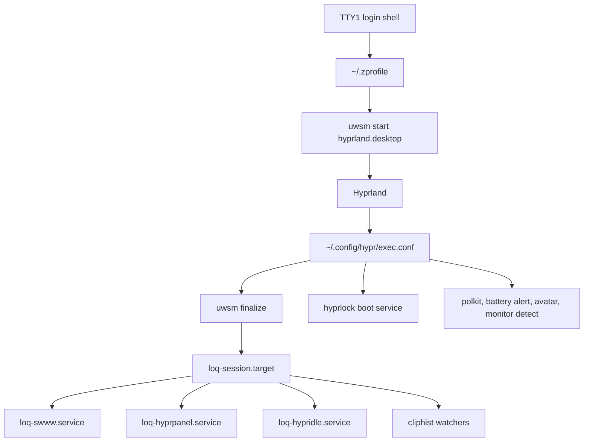

# What Runs on Boot

The login shell starts UWSM only on TTY1, only when no Wayland or X11 session is already active. Hyprland then imports the display environment, finalizes the UWSM session, and starts the Lumina user target.

`loq-session.target` is the ordering point for wallpaper, panel, idle, clipboard, and switcher services. Recovery tools intentionally bypass this path when needed.
